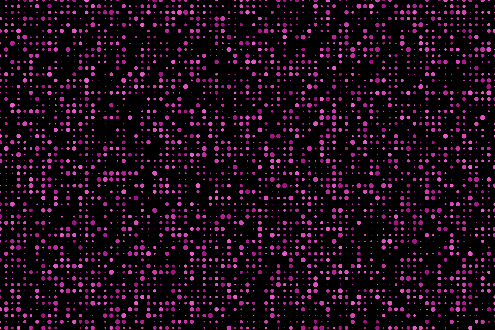

## Description
A [p5.js](https://p5js.org/) script turned interactive with the power of [Vue.js](https://vuejs.org/).

Mozaic design generator allows exporting designs as PNG stills and animated GIFs.

Currently hosted on [heroku](https://mozaic-generator.herokuapp.com/) as a PWA.


## Example
### PNG


### GIF


## Project setup
### Installs Dependencies
```
npm install
```

### Compiles and hot-reloads for development
```
npm run serve
```

### Compiles and minifies for production
```
npm run build
```

### Lints and fixes files
```
npm run lint
```